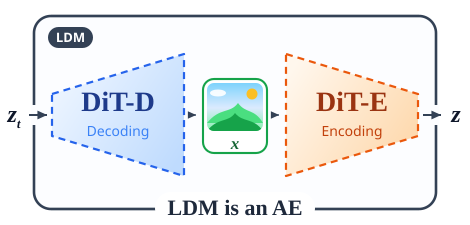
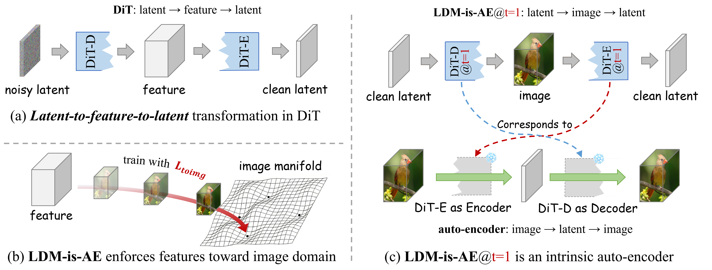

<h1> DiT-D (decoding) -> x (image domain) -> DiT-E (encoding) -> z">LDM-is-AE: Latent Diffusion Model is an Auto-Encoder for End-to-End Image Generation (NeurIPS, 2026)</h1>

[](LICENSE)
[](https://pytorch.org)
[](#citation)
[](https://arxiv.org/abs/2609.37080)
[](https://github.com/PolyU-VCLab/LDMisAE)
[](https://huggingface.co/xtudbxk/LDMisAE)

<br clear="all">


**[Zhengqiang Zhang](https://scholar.google.com/citations?user=UX26wSMAAAAJ&hl=en), [Lingchen Sun](https://scholar.google.com/citations?user=ZCDjTn8AAAAJ&hl=en), [Rongyuan Wu](https://scholar.google.com/citations?user=A-U8zE8AAAAJ&hl=en), [Qiaosi Yi](https://scholar.google.com/citations?user=y5bqy0AAAAAJ&hl=en), [Xiangtao Kong](https://scholar.google.com/citations?user=lueNzSgAAAAJ&hl=en), [Chaodong Xiao](https://scholar.google.com/citations?user=hvwY-uwAAAAJ&hl=en), [Lei Zhang](https://scholar.google.com/citations?user=tAK5l1IAAAAJ&hl=en)**<br>
The Hong Kong Polytechnic University &middot; OPPO Research Institute

<p align="center"> DiT-D (decoding) -> x (image domain) -> DiT-E (encoding) -> z"></p>

**Contents:** [Algorithm](#algorithm) &middot; [Quick Start](#quick-start) &middot; [Results](#results) &middot; [Model Weights](#model-weights) &middot; [Citation](#citation) &middot; [License](#license)

<h3 id="ldm-is-an-ae">💡 <ins>LDM is an AE.</ins></h3>

Latent diffusion is normally a two-stage pipeline: train a
VAE, then train a diffusion model in its latent space -- and inherit the VAE's bias. **LDM-is-AE removes
the pipeline.** We split the DiT backbone into **DiT-D** (the first 30 blocks) and **DiT-E** (the last 2 blocks) and
supervise the intermediate feature `F` in the image domain at every timestep. The backbone's hidden
`decode->encode` path then becomes an explicit **auto-encoder**, trained end-to-end in a single
stage without external VAE.

<p align="center"></p>

<sub><b>Figure 1.</b> <b>(a)</b> the DiT backbone performs <i>latent &rarr; feature &rarr; latent</i>;
<b>(b)</b> image-space supervision aligns the intermediate feature with the image domain at every timestep;
<b>(c)</b> at the zero-noise timestep (<code>t=1</code>) an explicit <i>latent &rarr; image &rarr; latent</i> path
makes the backbone an auto-encoder, which in turn enables <i>image &rarr; latent &rarr; image</i>.</sub>

---

<h2 id="algorithm">📐 <ins>Algorithm</ins></h2>

**Algorithm 1: Training loop of LDM-is-AE** -- a single-stage, end-to-end loop
(implemented in `ldm_is_ae/train.py` and `ldm_is_ae/denoiser.py`).

```text
Inputs: training set X, total iterations T
for i = 1, ..., T do
    (x, c) = sample_batch(X),  t ~ U[0, 1],  z_0 ~ N(0, I)

    // AE encoding
    x_u = pixel_unshuffle(x, p)                    # patchify to the image domain
    with torch.no_grad():
        z_1 = dit_e(x_u, t=1, c)                   # image-to-latent at t = 1 (no grad)

    // LDM denoising
    z_t    = t * z_1 + (1 - t) * z_0
    F, F'  = dit_d(z_t, t, c)                      # split output: image-aligned F and F'
    F_full = gamma(t) * F + (1 - gamma(t)) * F'    # auxiliary feature mixing
    z1_hat = dit_e(F_full, t, c)                   # map the mixed feature back to latent

    L_total = L_ldm(z1_hat, z_1) + w_toimg * L_toimg(F, x_u)   # latent loss + image-domain supervision
    L_total.backward()
    optimizer.step()
end for
```

---

<h2 id="quick-start">🚀 <ins>Quick Start</ins></h2>

### 0. Clone

```bash
git clone https://github.com/PolyU-VCLab/LDMisAE.git && cd LDMisAE
```

### 1. Install

```bash
pip install -r requirements.txt        # torch torchvision numpy scipy einops timm pillow
                                       # opencv-python requests tqdm dill loguru torch-fidelity
                                       # transformers (text-to-image only)
```

Two pre-trained assets are passed on the command line instead of a fixed path: the LPIPS `vgg.pth` via
`--lpips_model_path` (needed by training; the launchers forward `LPIPS_MODEL_PATH`), and the
torch-fidelity Inception-V3 weights via `TORCH_HOME` or `--weights`.

### 2. Get the weights

```bash
huggingface-cli download xtudbxk/LDMisAE LDMisAE.256.ckpt --local-dir weights
```

| Resolution | File | Size |
| --- | --- | --- |
| 256&times;256 | `LDMisAE.256.ckpt` | 3.90 GB |
| 512&times;512 | `LDMisAE.512.ckpt` | 3.93 GB |

### 3. Sample

```bash
# CKPT = a released .ckpt, or a run directory holding checkpoint-last.pth
CKPT=weights/LDMisAE.256.ckpt IMG_SIZE=256 CFG=2.25 NUM_IMAGES=50000 bash scripts/inference.sh
CKPT=weights/LDMisAE.512.ckpt IMG_SIZE=512 NPROC=8 CFG=2.2 bash scripts/inference.sh
```

### 4. Evaluate

```bash
bash scripts/evaluate.sh <sample_dir> <ref_stats.npz> [tag]
```

`<ref_stats.npz>` holds the reference `mu`/`sigma`: ADM `VIRTUAL_imagenet256_labeled.npz` /
`VIRTUAL_imagenet512.npz`, or the JiT statistics of the matching resolution.

### 5. Train

```bash
# class-conditional 256x256  (JiT-H/half: DiT-E 2 blocks / DiT-D 30 blocks)
IMAGENET_PATH=/data/imagenet256 BATCH_SIZE=16 NPROC=8 bash scripts/train_256.sh
# class-conditional 512x512
IMAGENET_PATH=/data/imagenet512 BATCH_SIZE=16 NPROC=8 bash scripts/train_512.sh
# text-to-image (STAGE=1 freezes the backbone, STAGE=2 trains jointly)
TEXT_ENCODER_PATH=/models/Qwen3_1.7B BLIP3O_PATH=/data/blip3o STAGE=1 BATCH_SIZE=16 NPROC=8 bash scripts/train_t2i.sh
```

`IMAGENET_PATH` is the **parent** of `train/` (the loader appends `train/` itself).

---

<h2 id="results">📊 <ins>Results</ins></h2>

Class-conditional ImageNet generation at 256&times;256 (**Table 1**) and 512&times;512 (**Table 2**).
*Models*: Gen. = generator, AE = autoencoder, Dec. = decoder, VFM = vision foundation model;
*Repr.*: Pixel = pixel diffusion, Fixed = a fixed latent representation, Dynamic = a dynamically evolved
latent representation in training; *Aux. data* = external training data beyond ImageNet; *Training FLOPs*
(&times;10<sup>19</sup>) is the generator-only training cost and does not include the cost of training a
separate AE or VFM.

**Table 1. Class-conditional ImageNet generation at 256&times;256.**

| Method | Models | Repr. | Total params (M) | Epochs | Aux. data | Training FLOPs | FID &darr; | IS &uarr; |
| --- | --- | --- | ---: | ---: | :--- | ---: | ---: | ---: |
| **Two-stage** | | | | | | | | |
| DiT-XL/2 | Gen.+AE | Fixed | 759 | 1400 | OpenImages | 45.4 | 2.27 | 278 |
| SiT-XL/2 | Gen.+AE | Fixed | 759 | 1400 | OpenImages | 45.4 | 2.06 | 270 |
| LightningDiT | Gen.+AE+VFM | Fixed | 745 | 800 | &ndash; | 19.1 | 1.35 | 295 |
| REPA-SiT | Gen.+AE+VFM | Fixed | 759 | 800 | OpenImages | 25.9 | 1.29 | 306 |
| DDT-XL/2 | Gen.+AE+VFM | Fixed | 759 | 400 | OpenImages | 19.2 | 1.26 | 311 |
| REPA-E (tuning) | Gen.+AE+VFM | Fixed | 759 | 800 | OpenImages | 57.8 | 1.12 | 303 |
| SVG-XL | Gen.+AE+VFM | Fixed | 758 | 1400 | DINOv3 | 22.8 | 1.92 | 265 |
| RAE-DiT<sup>DH</sup> | Gen.+AE+VFM | Fixed | 839 | 800 | DINOv2 | &ndash; | 1.13 | 263 |
| **One-stage** | | | | | | | | |
| REPA-E (scratch) | Gen.+AE+VFM | Dynamic | 759 | 80 | &ndash; | 5.78 | 1.67 | &ndash; |
| UNITE-XL | Gen.+Dec. | Dynamic | 763 | 240 | &ndash; | 12.0 | 1.75 | 310 |
| DSD | Gen.+VFM | Dynamic | 205 | 50 | &ndash; | &ndash; | 3.35 | 255 |
| ADM-U | Gen. | Pixel | 554 | 400 | &ndash; | &ndash; | 4.59 | 187 |
| RIN | Gen. | Pixel | 410 | 480 | &ndash; | 20.5 | 3.42 | 182 |
| PixNerd | Gen.+VFM | Pixel | 700 | 160 | &ndash; | 5.49 | 2.15 | 297 |
| PixelFlow | Gen. | Pixel | 677 | 320 | &ndash; | 239 | 1.98 | 282 |
| JiT-H/16 | Gen. | Pixel | 953 | 600 | &ndash; | 14.0 | 1.86 | 303 |
| **LDM-is-AE (Ours)** | Gen. | Dynamic | 961 | 300 | &ndash; | 7.02 | **1.80** | **314** |

**Table 2. Class-conditional ImageNet generation at 512&times;512.**

| Method | Models | Repr. | Total params (M) | FID &darr; | IS &uarr; |
| --- | --- | --- | ---: | ---: | ---: |
| **Two-stage** | | | | | |
| DiT-XL/2 | Gen.+AE | Fixed | 759 | 3.04 | 241 |
| SiT-XL/2 | Gen.+AE | Fixed | 759 | 2.62 | 252 |
| REPA-SiT-XL/2 | Gen.+AE+VFM | Fixed | 759 | 2.08 | 275 |
| **One-stage** | | | | | |
| ADM-G | Gen. | Pixel | 559 | 7.72 | 173 |
| RIN | Gen. | Pixel | 320 | 3.95 | 216 |
| PixNerd-XL/16 | Gen.+VFM | Pixel | 700 | 2.84 | 246 |
| DeCo | Gen. | Pixel | 682 | 2.22 | 290 |
| JiT-H/32 | Gen. | Pixel | 956 | 1.94 | 309 |
| **LDM-is-AE (Ours)** | Gen. | Dynamic | 961 | **1.90** | **320** |

---

<h2 id="model-weights">🤗 <ins>Model Weights</ins></h2>

https://huggingface.co/xtudbxk/LDMisAE

| File | Resolution | Size |
| --- | --- | --- |
| `LDMisAE.256.ckpt` | 256&times;256 | 3.90 GB |
| `LDMisAE.512.ckpt` | 512&times;512 | 3.93 GB |

---

<h2 id="citation">📝 <ins>Citation</ins></h2>

Paper: **arXiv:2609.37080** &mdash; https://arxiv.org/abs/2609.37080

```bibtex
@inproceedings{ldm_is_ae_2026,
  title     = {LDM-is-AE: Latent Diffusion Model is an Auto-Encoder for End-to-End Image Generation},
  author    = {Zhang, Zhengqiang and Sun, Lingchen and Wu, Rongyuan and Yi, Qiaosi and
               Kong, Xiangtao and Xiao, Chaodong and Zhang, Lei},
  booktitle = {Advances in Neural Information Processing Systems (NeurIPS)},
  year      = {2026}
}
```

---

<h2 id="license">⚖️ <ins>License</ins></h2>

Code: **Apache License 2.0** -- see `LICENSE`. Model weights and data are released separately and are
intended for research use.
